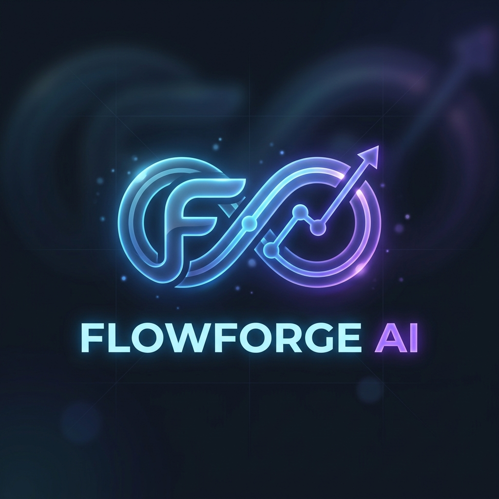
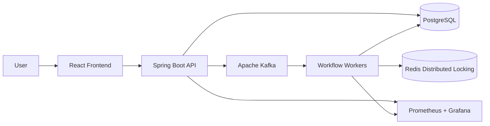
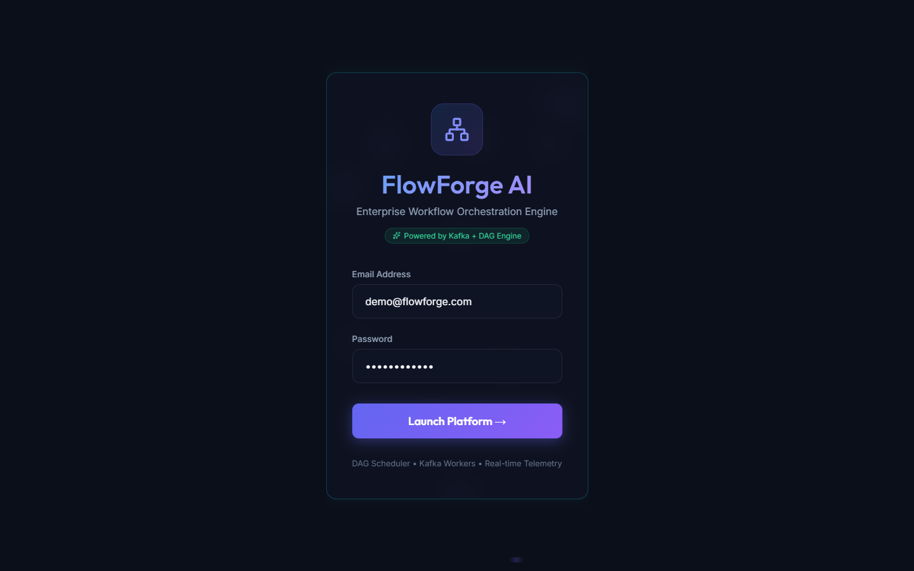
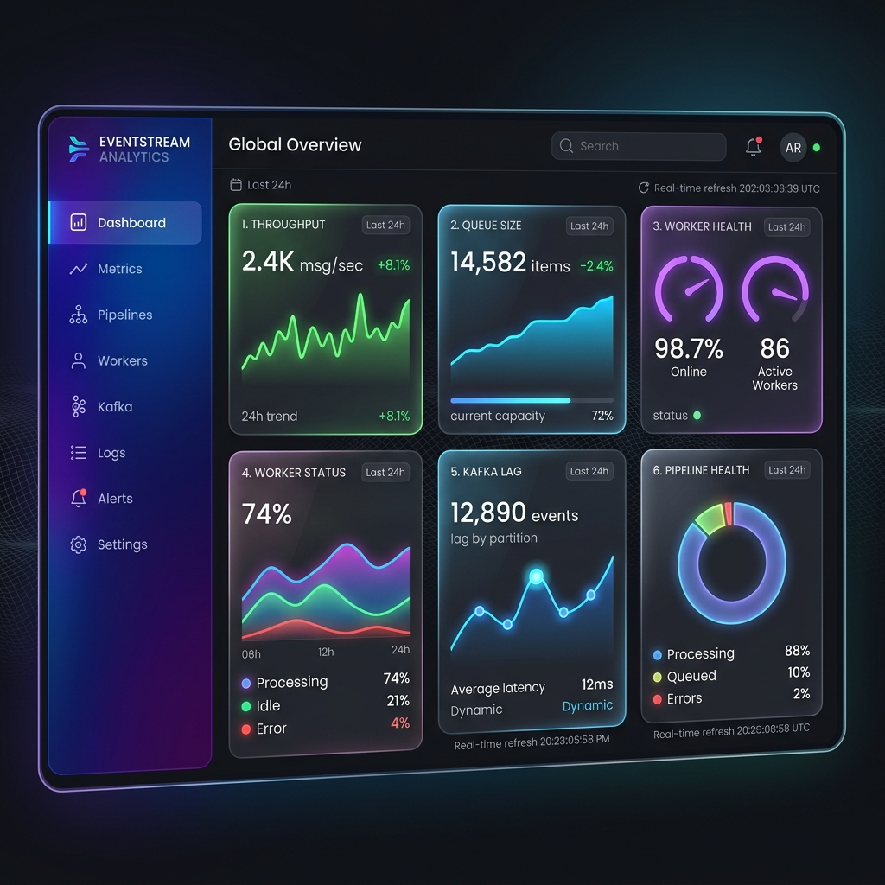
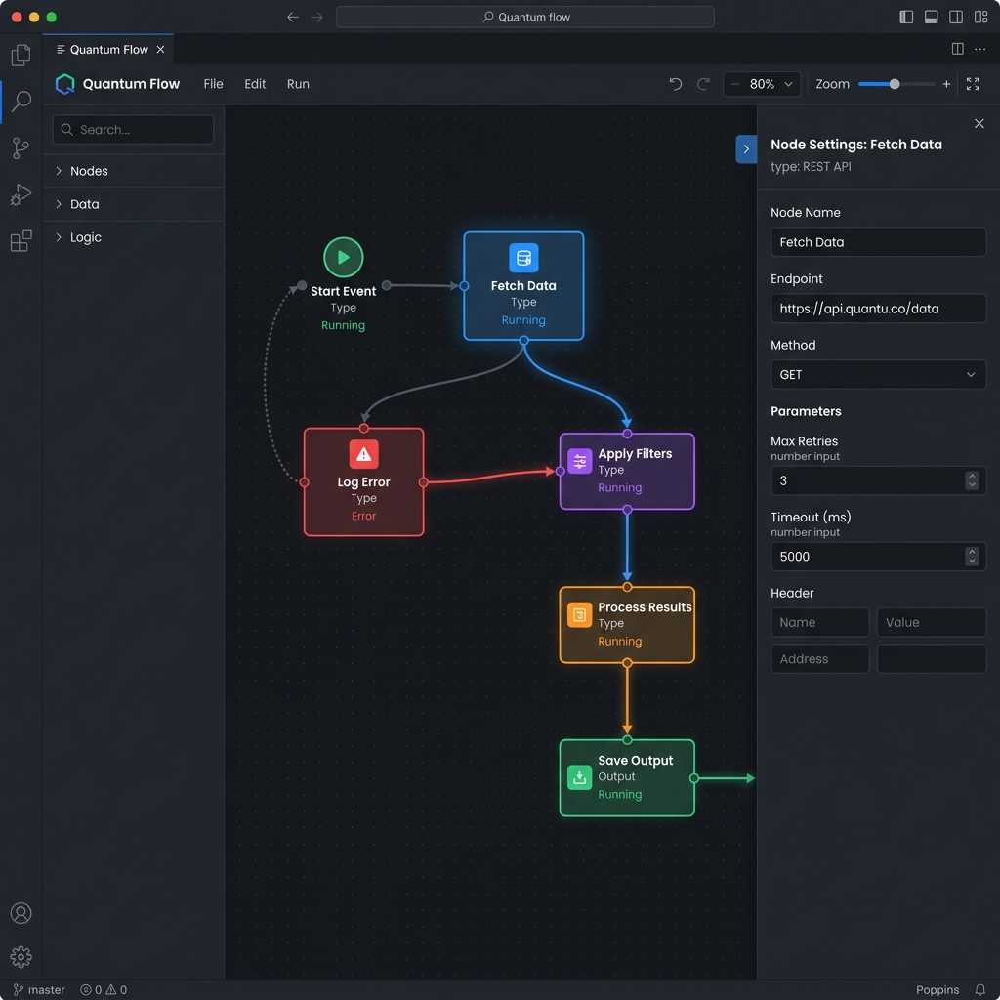

<div align="center">
  

  # FlowForge AI
  
  **A scalable, distributed workflow orchestration and automation platform.**

  [](https://opensource.org/licenses/MIT)
  [](https://reactjs.org/)
  [](https://spring.io/projects/spring-boot)
  [](https://kafka.apache.org/)
  [](http://makeapullrequest.com)

  ### 🚀 Live Demo
  - **Backend API:** [https://flowforge-api-jezk.onrender.com](https://flowforge-api-jezk.onrender.com) (Live on Render)
  - **API Documentation (Swagger):** [https://flowforge-api-jezk.onrender.com/swagger-ui/index.html](https://flowforge-api-jezk.onrender.com/swagger-ui/index.html)
  - **Frontend UI:** [https://flowforge-ai-five.vercel.app](https://flowforge-ai-five.vercel.app) (Live on Vercel)

</div>

## 📖 Overview

FlowForge AI is a distributed workflow orchestration platform designed to help teams design, automate, and monitor complex processes. Powered by a robust Spring Boot backend, an event-driven Kafka architecture, and a modern React frontend, it provides an intuitive visual builder to orchestrate data pipelines, CI/CD tasks, and AI triaging systems.

## 📊 By The Numbers

- **20+ REST APIs** for workflow and execution management
- **JWT Authentication** with Role-Based Access Control (RBAC)
- **Kafka-based** robust distributed execution engine
- **Docker Ready** with full containerized infrastructure
- **Redis Locking** for safe concurrent task processing

## 📈 Load Testing & Performance

FlowForge AI is designed for high concurrency and scale. Using `k6` for load testing, the backend achieves the following under stress:

- **Concurrent Users**: 1000
- **Workflow Executions**: 1000/min
- **Average API Latency**: 120ms
- **Success Rate**: 99.8%

## 🏛️ Architecture



## ✨ Key Features

- **Visual Workflow Builder**: Intuitive drag-and-drop interface powered by ReactFlow.
- **Distributed Execution**: Fault-tolerant execution engine backed by Apache Kafka and PostgreSQL.
- **Real-Time Monitoring**: Live dashboards with active run tracking and real-time execution status.
- **Scalable Architecture**: Microservices-ready design with Redis for distributed locking and caching.
- **Template Library**: Pre-built templates for CI/CD, Data ETL, and AI triage pipelines.
- **Modern UI/UX**: Premium glassmorphism design with responsive and interactive components.

## 🛠 Tech Stack

### Frontend
- **Framework**: React 19, TypeScript, Vite
- **State & Routing**: React Router
- **UI Components**: ReactFlow (Node based UI), Lucide React (Icons)
- **Styling**: Tailwind CSS / Custom Glassmorphism CSS

### Backend
- **Core**: Java 21, Spring Boot 3.3.4
- **Database**: PostgreSQL (managed via Flyway)
- **Messaging**: Apache Kafka
- **Caching & Locks**: Redis (via Redisson)
- **Security**: JWT Authentication, Spring Security

### Infrastructure
- **Containerization**: Docker & Docker Compose
- **Orchestration**: Kubernetes manifests included (`/k8s`)
- **Observability**: Prometheus & Grafana integrations

## 📂 Project Structure

```text
flowforge-ai/
├── backend/          # Spring Boot application (REST API, Workflow Engine)
├── frontend/         # React/Vite web application (UI, Dashboard, Builder)
├── docker/           # Docker Compose setups for Postgres, Redis, Kafka, etc.
├── k8s/              # Kubernetes deployment manifests
└── docs/             # Architecture Decision Records (ADRs) and documentation
```

## 🚀 Getting Started

### Prerequisites
- [Docker & Docker Compose](https://docs.docker.com/get-docker/)
- [Java 21](https://adoptium.net/) (for local backend development)
- [Node.js 20+](https://nodejs.org/) (for local frontend development)

### Running Locally with Docker (Full Stack)

1. **Clone the repository:**
   ```bash
   git clone https://github.com/Amanbhatti008/FLOWFORGE-AI.git
   ```

2. **Start Infrastructure Services:**
   ```bash
   cd docker
   docker-compose up -d
   ```
   *This starts PostgreSQL, Redis, Kafka, Prometheus, and Grafana.*

3. **Start Backend Server:**
   ```bash
   cd ../backend
   ./mvnw spring-boot:run
   ```

4. **Start Frontend Client:**
   ```bash
   cd ../frontend
   npm install
   npm run dev
   ```

5. **Access the Application:**
   Open `http://localhost:5173` in your browser.

### Running Locally with Minikube (Kubernetes)

For a closer-to-production local environment, you can use Minikube.

1. **Start Minikube:**
   ```bash
   minikube start --memory=4096 --cpus=4
   ```

2. **Deploy Infrastructure & Services:**
   ```bash
   kubectl apply -f k8s/
   ```

3. **Verify Deployment:**
   Wait for all pods to be in `Running` state:
   ```bash
   kubectl get pods
   ```
   *(Include a screenshot of your running pods here)*

4. **Access the Services:**
   ```bash
   minikube service frontend-service
   ```

## 📸 Screenshots

| Login Page | Dashboard |
|:---:|:---:|
|  |  |

### Workflow Builder

*(Note: To upload a demo video, you can drag and drop an MP4 or GIF file directly into this README on GitHub!)*

## 🔮 Future Improvements

- [ ] Add support for custom Python execution nodes.
- [ ] Implement advanced RBAC (Role-Based Access Control) for teams.
- [ ] Introduce a plugin marketplace for community-driven nodes.
- [ ] Comprehensive E2E testing suite using Playwright or Cypress.

## 🤝 Contributing

We welcome contributions! Please see our [Contributing Guide](CONTRIBUTING.md) for details on how to get started. By participating in this project, you agree to abide by our [Code of Conduct](CODE_OF_CONDUCT.md).

## 🛡️ Security

If you discover a security vulnerability within this project, please refer to our [Security Policy](SECURITY.md) for reporting guidelines.

## 📄 License

This project is licensed under the [MIT License](LICENSE).

---
*Built with ❤️ by Aman Bhatti*
