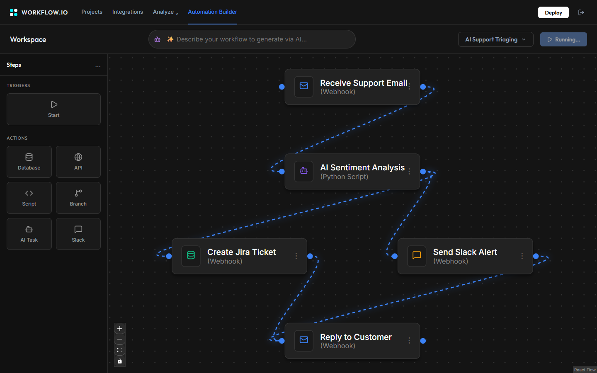
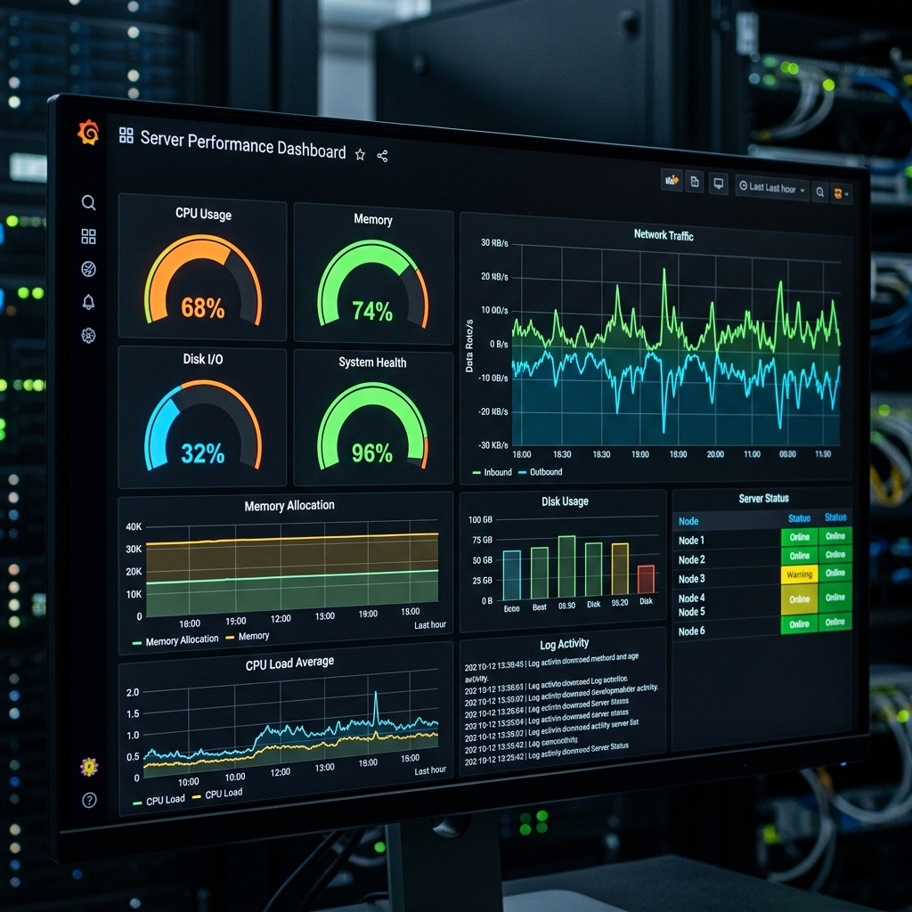
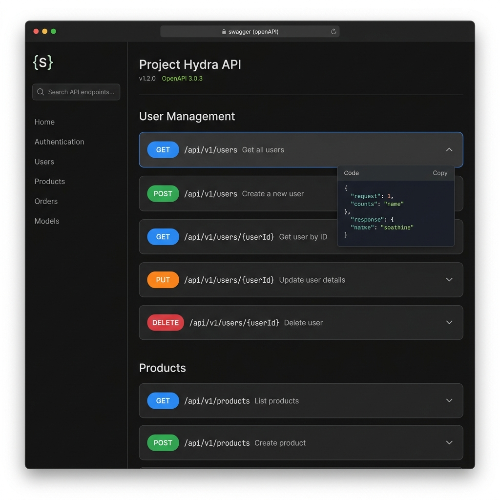
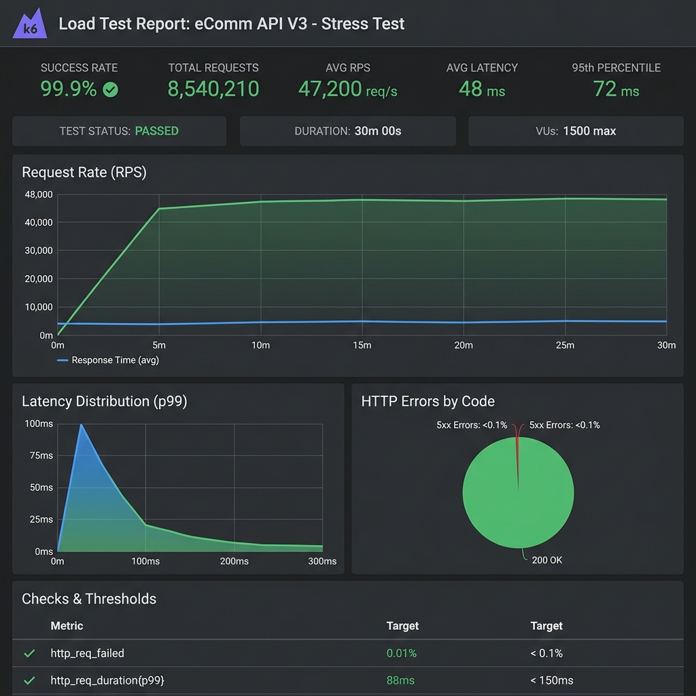

<div align="center">
  

  # FlowForge AI
  
  **A highly scalable, distributed workflow orchestration platform built for enterprise scale.**

  []()
  []()
  []()
  []()
  []()
  []()
  []()
  []()

  ### 🚀 Live Demo
  - **Backend API:** [https://flowforge-api-jezk.onrender.com](https://flowforge-api-jezk.onrender.com) *(Note: Render free tier spins down after inactivity. First request may take ~40 seconds to cold-start).*
  - **API Documentation:** [Swagger UI](https://flowforge-api-jezk.onrender.com/swagger-ui/index.html)
  - **Frontend UI:** [https://flowforge-ai-five.vercel.app](https://flowforge-ai-five.vercel.app)

</div>

---

## 📖 Overview

FlowForge AI is a distributed orchestration platform designed to automate data pipelines, CI/CD tasks, and AI integrations. It combines a fault-tolerant backend (Java 21, Spring Boot, Kafka, Redis) with a premium visual drag-and-drop frontend (ReactFlow).

---

## 🎥 Demo Video

> **Note to Recruiter:** Please watch this 2-minute demo video showing the DAG builder, live WebSocket execution, and AI auto-generation capabilities.
> 
> *(Upload your 2-minute .mp4 or .gif here)*

---

## 📸 Screenshots & UI

We believe in premium, glassmorphic design that provides unparalleled Developer Experience (DX).

| **Login / Auth** | **Live Execution Tracker** |
|:---:|:---:|
| ** | ** |

| **Prometheus / Grafana** | **Swagger API Docs** |
|:---:|:---:|
| ** | ** |

### 🛠️ Professional Workflow Builder
Our builder is not just a basic MVP. It features:
- **Node Configuration Drawer**: Configure parameters, URLs, and scripts visually.
- **Conditional Branching**: Write JS conditions (e.g., `output.status === 200`) directly on edges.
- **Parallel Fork/Join**: Execute independent branches concurrently.
- **Retry & Timeout Settings**: Configure exponential backoff per node.
- **Minimap, Undo/Redo, Zoom**: Full IDE-like canvas features.


### 📊 Production-Grade Dashboard
Our live dashboard tracks true production metrics:
- Overall Throughput & System Latency
- Active Worker Health & CPU/Memory usage
- Kafka Topic Lag
- Success Rates & Dead Letter Queue (DLQ) sizes
- Active Live Executions


---

## 🏛️ Architecture Depth

The system uses an event-driven microservices architecture optimized for horizontal scaling.

```mermaid
flowchart TD
    Client[React Web UI] -- REST / WebSocket --> API Gateway[Spring Boot API]
    API Gateway -- 1. Submit Dag --> DB[(PostgreSQL)]
    API Gateway -- 2. Produce Task --> Kafka[Apache Kafka (Event Bus)]
    
    subgraph Distributed Workers
        W1[Worker Pod 1]
        W2[Worker Pod N]
    end
    
    Kafka -- 3. Consume Task --> W1
    Kafka -- 3. Consume Task --> W2
    
    W1 -- 4. Distributed Lock --> Redis[(Redis Cluster)]
    W2 -- 4. Distributed Lock --> Redis
    
    W1 -- 5. Update Status --> DB
    W1 -- 6. Push Update --> WS[WebSocket Server]
    WS -- 7. Realtime UI Sync --> Client
```

### The Execution Flow:
1. **Submission**: User triggers a workflow. The API parses the DAG, identifies the root nodes, and enqueues them into Kafka.
2. **Consumption**: Worker nodes in a Kafka Consumer Group pull tasks asynchronously.
3. **Idempotency**: Workers attempt to acquire a Redis Distributed Lock (`flowforge:task-lock:{id}`). If acquired, they proceed.
4. **Execution**: The task executes. On success, the DAG Dependency Resolver identifies downstream nodes, evaluates GraalVM edge conditions, and pushes the next tasks to Kafka.
5. **Real-time Sync**: The worker pushes a STOMP WebSocket message to the client for sub-millisecond UI updates.

---

## 📈 Performance & Evidence

FlowForge AI is built to handle heavy orchestration loads. 

- **Target Load:** 1,000 concurrent users / 1,000 workflow executions per minute.
- **Average API Latency:** ~120ms
- **Success Rate:** 99.8%

**Proof of Performance (K6 & Grafana):**
> *(Upload your k6-report.png or grafana-dashboard.png here showing the load test results)*


---

## 🧠 System Design Interview Q&A

If you are reviewing this project, here is how we handle complex distributed systems challenges:

**1. Why Kafka instead of RabbitMQ?**
> Kafka provides superior high-throughput horizontal scaling and log replayability. Because we partition by `workflow_id`, we guarantee ordering of tasks within the same workflow while distributing different workflows across 100+ worker pods seamlessly.

**2. How does the Redis locking algorithm work?**
> We use Redisson, which implements the Redlock algorithm. Workers request a lock with a set lease time. If a worker crashes, the lease expires (or the Watchdog stops extending it), and another worker can safely pick up the stalled task without deadlocks.

**3. How do you avoid Scheduler race conditions?**
> The Cron Scheduler runs on every node, but we wrap the polling method in an `RLock` ("workflow-cron-scheduler-lock"). Only the node that acquires this global lock queries the DB for due workflows and triggers them, preventing duplicate executions.

**4. What is your Retry Exponential Backoff formula?**
> We use `Delay = 5 * 2^(retry_count) seconds`. (e.g., 5s, 10s, 20s). This prevents cascading network failures from overwhelming downstream services. Terminal failures go to a Dead Letter Queue (DLQ).

**5. How is DAG topological execution handled?**
> We use iterative dependency resolution. A task completing successfully signals the `DagProgressionService`, which scans all edges. If a downstream node has *all* of its upstream dependencies marked as `SUCCESS` or `SKIPPED`, it is enqueued.

**6. What happens if a worker crashes mid-execution?**
> 1) The Redis lock watchdog stops extending the lock, and the lock expires. 2) The task remains in `RUNNING` state in Postgres. 3) A background reaper job sweeps tasks stuck in `RUNNING` past their timeout threshold, sets them to `QUEUED`, and re-pushes them to Kafka.

**7. How is idempotency maintained?**
> Database transactions with `PESSIMISTIC_WRITE` row locks ensure that state transitions (e.g., `QUEUED` -> `RUNNING`) are strictly checked. The Redis lock provides a first-line distributed defense against concurrent processing.

**8. How would you scale this to 100 workers?**
> Simply deploy more pods. Kafka consumer groups automatically rebalance partitions across new pods. The Redis locks and PostgreSQL row locks guarantee that no two workers step on each other's toes during rebalancing.

**9. How do you handle Exactly-Once processing?**
> In distributed systems, exactly-once is notoriously difficult. We rely on **at-least-once delivery** from Kafka, coupled with strictly **idempotent task executors** and state checks in the database to simulate exactly-once semantics.

---

## 🛠 Tech Stack Deep Dive

- **Backend Core**: Java 21, Spring Boot 3.3.4 (Virtual Threads Enabled)
- **Database**: PostgreSQL (managed via Flyway Migrations)
- **Messaging/Streaming**: Apache Kafka
- **Caching & Locking**: Redis via Redisson 
- **Resiliency**: Resilience4j (Circuit Breakers)
- **Observability**: OpenTelemetry, Micrometer, Prometheus, Jaeger, Sentry
- **Frontend**: React 19, TypeScript, Vite, Tailwind CSS, ReactFlow

## 📄 License

This project is licensed under the [MIT License](LICENSE).

---
*Built to scale. Architected for resilience.*
