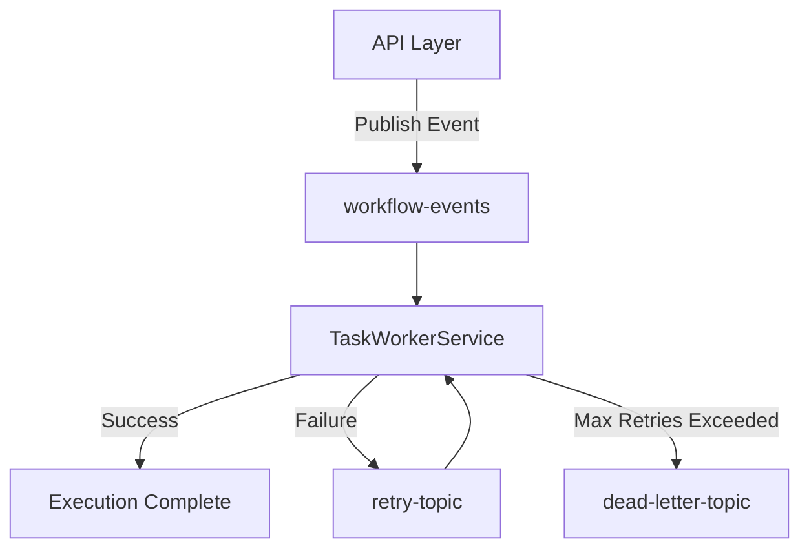

# Kafka Event Flow

FlowForge utilizes an event-driven architecture using Apache Kafka to ensure decoupling, scalability, and resilience.

## Overview

## Topics

1. **workflow-events**: The primary topic for initiating and advancing workflows.
2. **retry-topic**: Automatically routed here when transient errors occur (using `@RetryableTopic`).
3. **dead-letter-topic (DLQ)**: The final destination for messages that fail all retry attempts.

## Resilience

- **Retry Strategy**: We use an exponential backoff strategy for retries.
- **Outbox Pattern**: Database transactions are synchronized with Kafka events to prevent dual-write issues (i.e. we use Transactional Outbox pattern).
